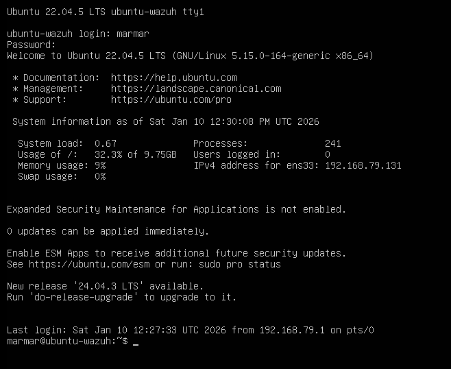
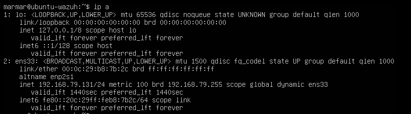
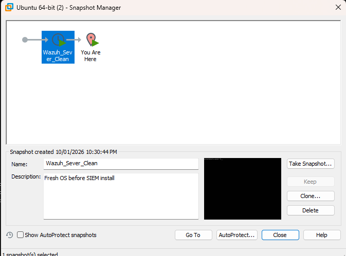
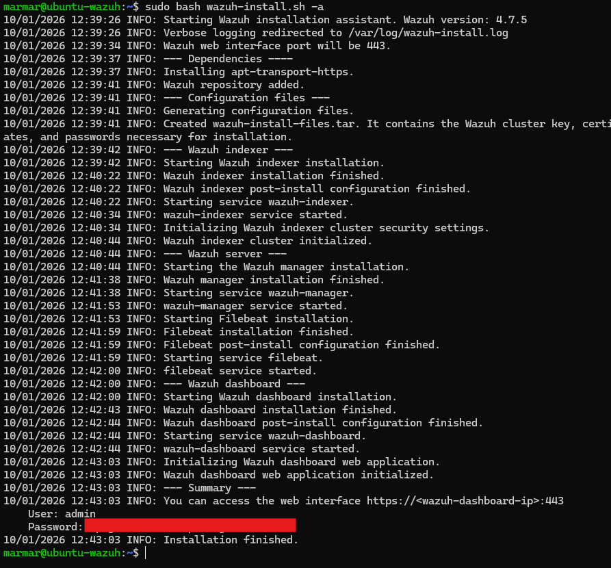
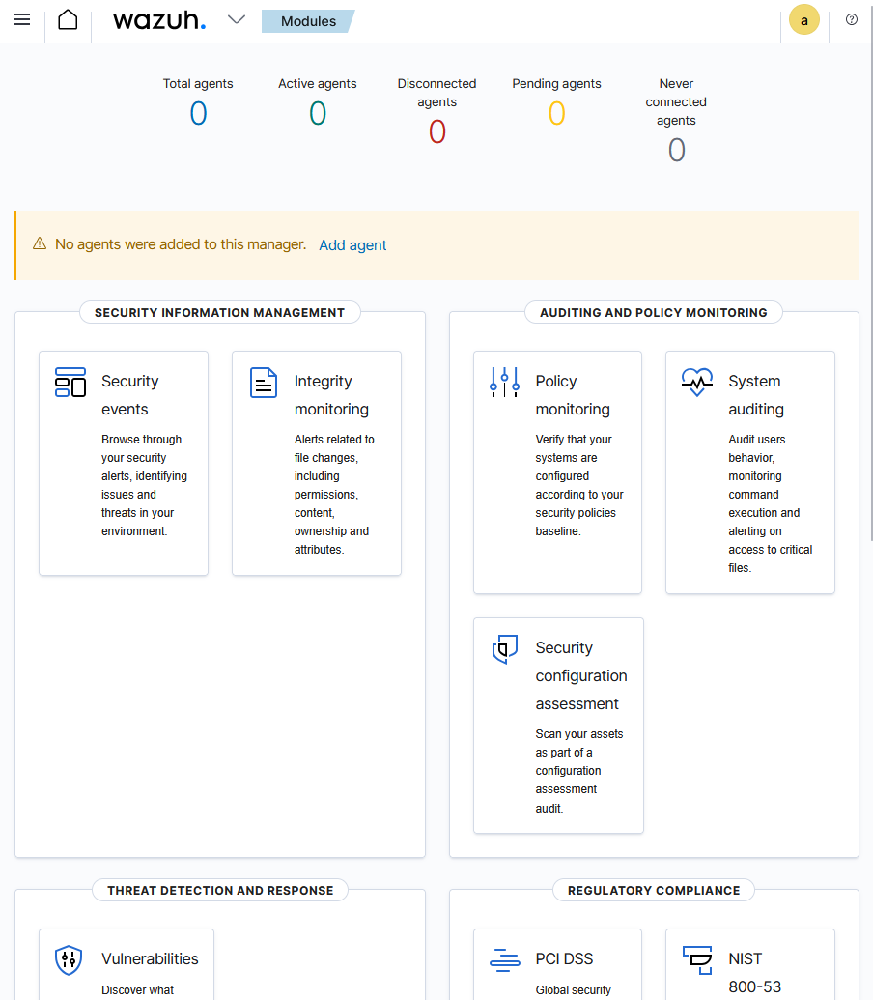

# 🗂️ **WEEK 2 — Wazuh SIEM Installation**
## Short Summary
A dedicated Ubuntu Server was deployed as a standalone SIEM server. Wazuh was installed using the official all-in-one deployment script, providing the manager, indexer, and dashboard components.

After installation, the Wazuh dashboard was accessed via browser, confirming successful deployment and service availability. This SIEM instance will be used to onboard endpoints and analyze security logs in subsequent stages.

### Screenshots

---

---

