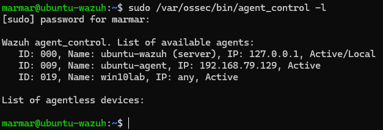
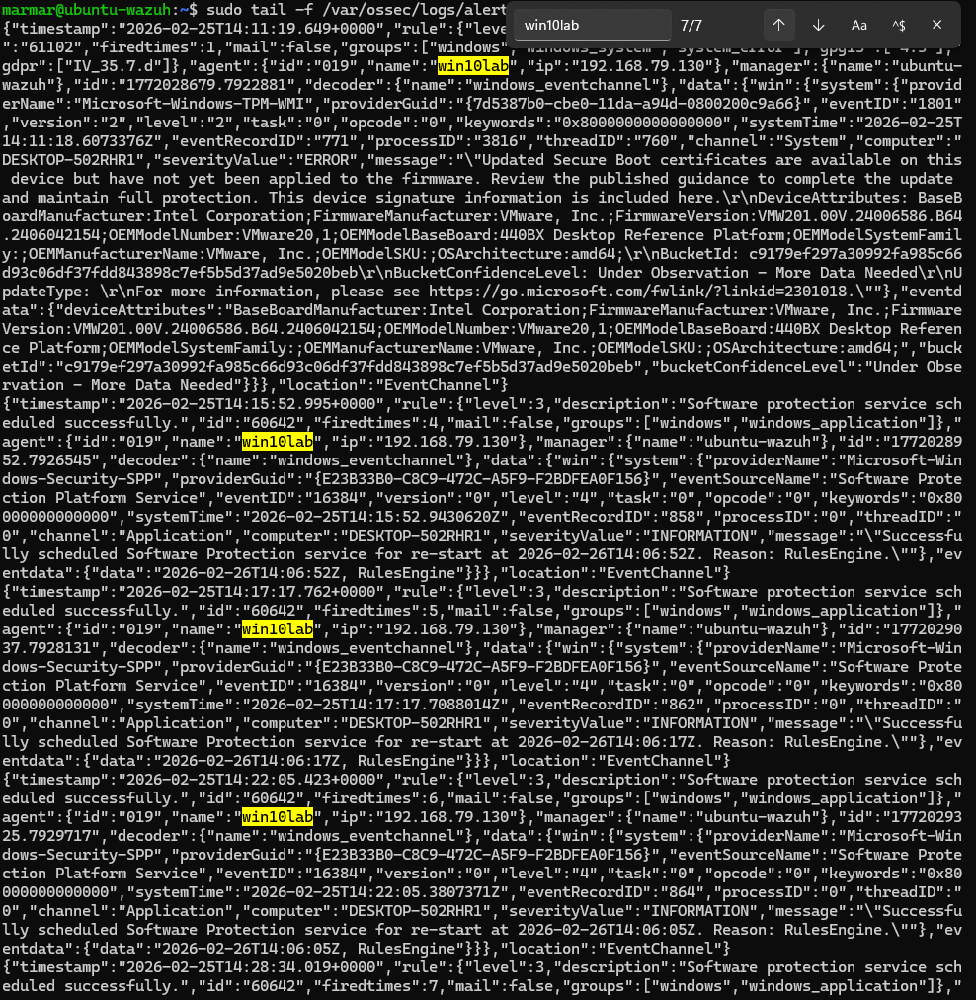
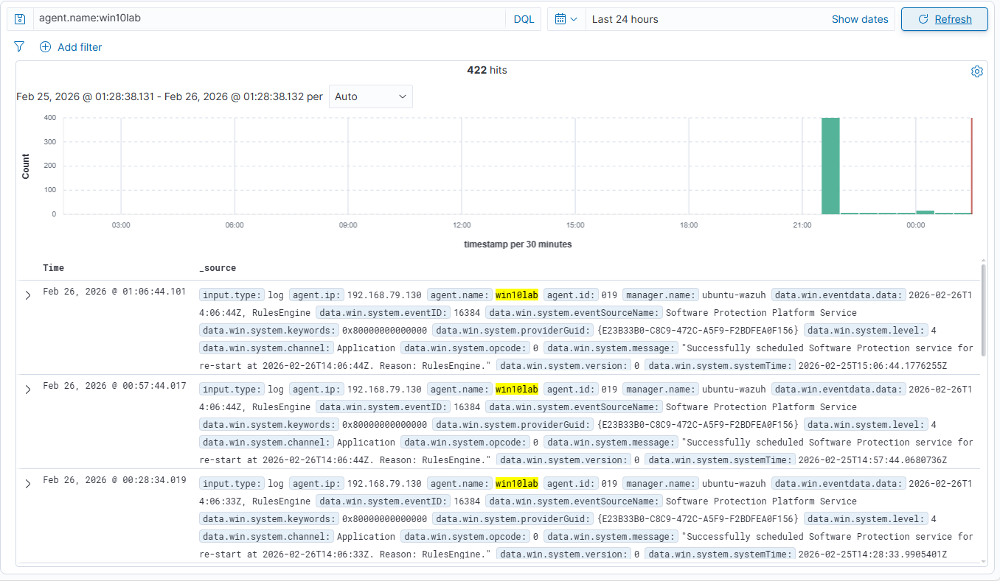
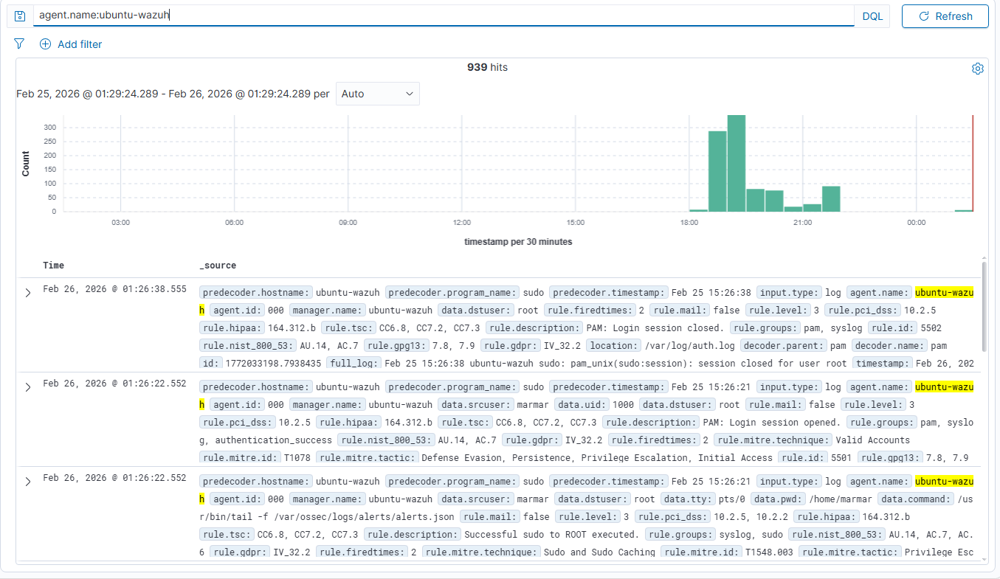
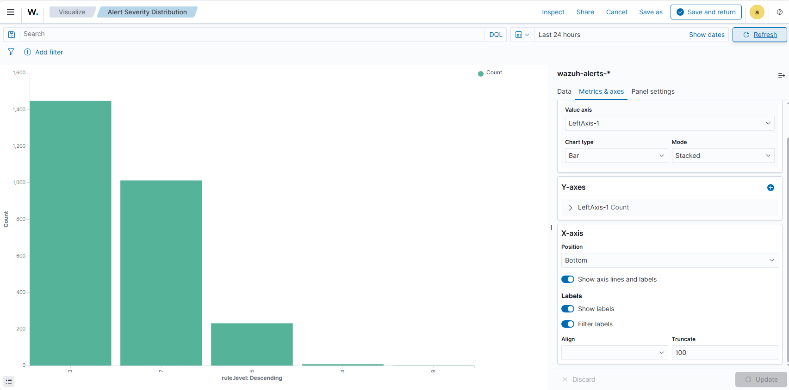

#  **WEEK 3 — Connect Agents & Collect Logs**
## Short Summary
Windows 10 and Ubuntu Linux endpoints were onboarded as agents to the Wazuh SIEM server. Agent enrollment was verified and duplicate or inactive agent entries were removed to ensure a clean environment.

Log ingestion was confirmed by observing alerts written to the alerts.json file on the manager, validating Filebeat delivery to the Wazuh Indexer, and confirming that events were searchable within the Discover interface. A basic bar chart visualization displaying alert severity distribution was created to demonstrate successful indexing and visualization of security events.

## Screenshots
### Wazuh Manager – Registered Agents

### Windows Endpoint Logs Ingested into Wazuh

### Windows Agent Logs Ingested into Wazuh

### Ubuntu Server Logs Ingested into Wazuh

## Alert Severity Distribution Visualization

