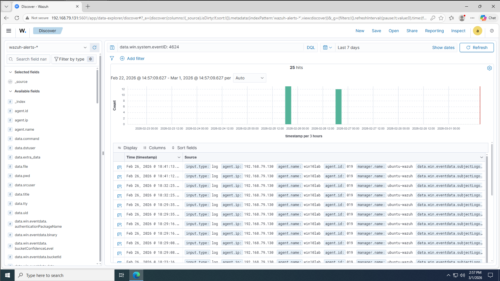
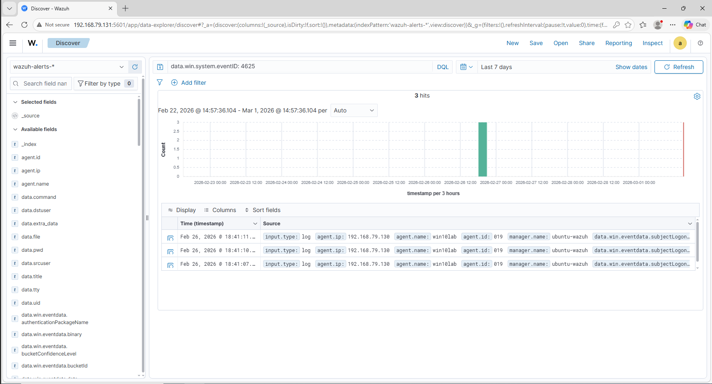
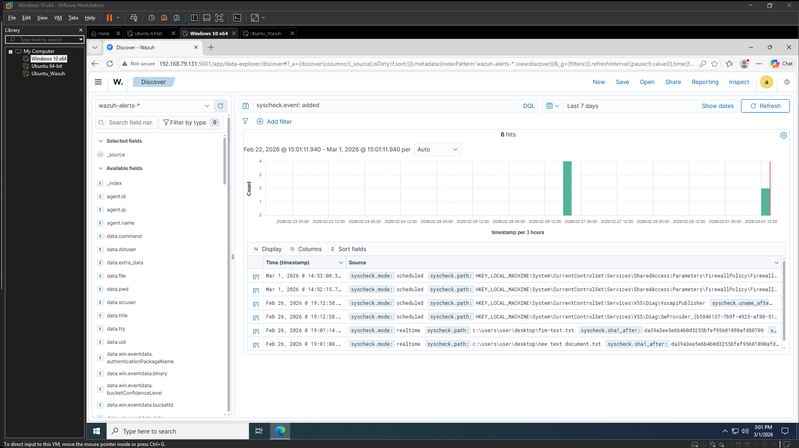
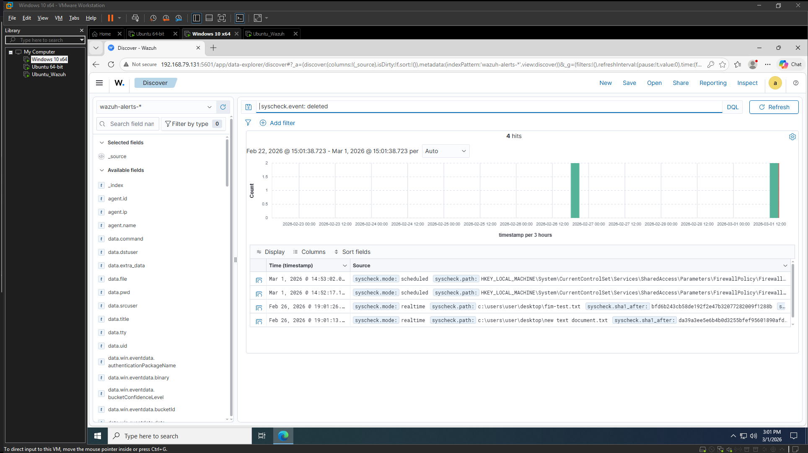
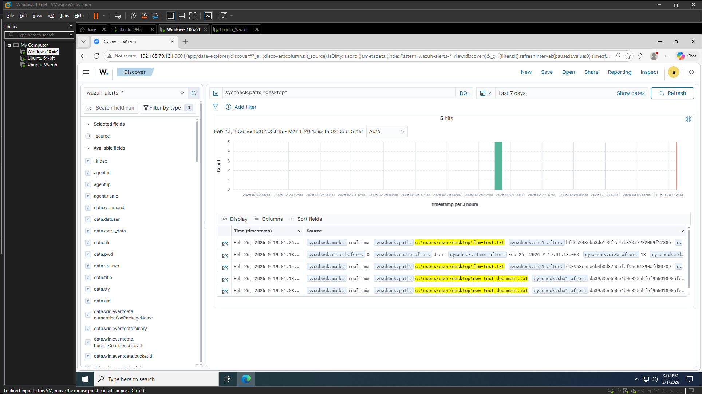

# **WEEK 4 — Baseline Monitoring & FIM Validation**

## Short Summary

Baseline system activity was analyzed to understand normal authentication and file integrity behavior within the Wazuh SIEM environment.

Successful (4624) and failed (4625) Windows authentication events were generated intentionally and verified through the Discover interface using precise field-based queries. Event clustering patterns were observed during repeated failed login attempts to establish behavioral context for future anomaly detection.

File Integrity Monitoring (FIM) was configured for the Windows Desktop directory with real-time monitoring enabled. File creation, modification, and deletion events were successfully detected and indexed. Query behavior differences between exact phrase matching and wildcard searches were analyzed to understand field mapping and keyword indexing within Wazuh.

This phase validates both log ingestion integrity and operational querying proficiency.

---

## Authentication Event Validation

Successful Logons (Event ID 4624) were confirmed using:

`data.win.system.eventID: 4624

Failed Logons (Event ID 4625) were confirmed using:

`data.win.system.eventID: 4625

Repeated failed login attempts produced visible timestamp clustering, demonstrating detectable behavioral patterns.

---

## File Integrity Monitoring (FIM)

Real-time monitoring enabled for:

C:\Users\User\Desktop

Lifecycle validation performed through:

- File creation
    
- File modification
    
- File deletion
    

Query used:

`syscheck.event: added OR syscheck.event: modified OR syscheck.event: deleted

Wildcard matching was required for partial path filtering:

`syscheck.path: *desktop*

This validated correct indexing behavior for keyword fields.

---

## Screenshots

### Successful Authentication Events (4624)

### Failed Authentication Events (4625)

### File Creation Event

### File Deletion Event

### Wildcard Path Query Demonstration

## Operational Skills Demonstrated

- Authentication event analysis
    
- Windows Security log field mapping
    
- Real-time File Integrity Monitoring configuration
    
- SIEM query precision (exact vs wildcard matching)
    
- Controlled security event simulation
    
- Baseline behavioral analysis
